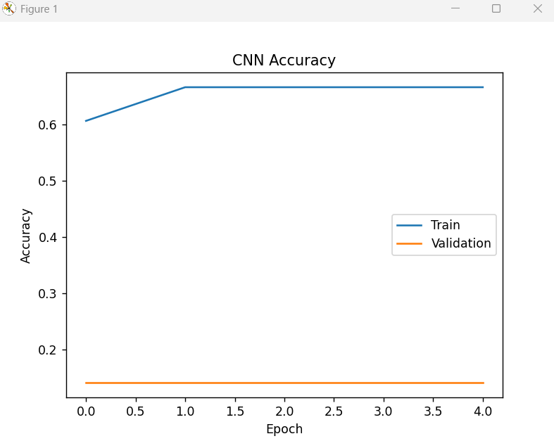

# Image Classification using CNN and VGG16

This project demonstrates **image classification using deep learning** with:

* A custom **Convolutional Neural Network (CNN)**
* **Transfer Learning with VGG16**

The project compares a CNN built from scratch with a pretrained model.

## Features

* Image data augmentation
* CNN architecture for feature extraction
* Transfer learning using VGG16
* Model training and validation
* Accuracy visualization

## Project Structure

image-classification-cnn-vgg16

dataset/
train/
validation/

src/
cnn_model.py
vgg16_transfer_learning.py

results/
cnn_accuracy.png
transfer_learning_accuracy.png

README.md
requirements.txt

## Installation

Install dependencies:

pip install -r requirements.txt

## Run CNN Model

python src/cnn_model.py

## Run Transfer Learning Model

python src/vgg16_transfer_learning.py

## Results

Example training accuracy:

## Technologies Used

* Python
* TensorFlow / Keras
* NumPy
* Matplotlib

## Author

Syed Razviuddin
